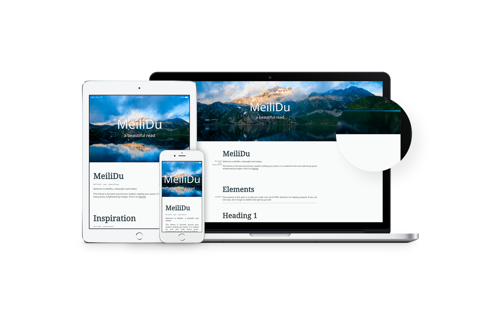

# MeiliDu

[](http://www.repostatus.org/#active)
 
> a beautiful read

A simple, text focused theme for Hexo. Bringing your readers attention to what is most import: your posts.  
Check out the [Demo](https://meilidu.github.io/)



# Get started

:exclamation: Make sure your **Node version is 6.x or above** as the theme uses some ES6 syntax. :exclamation:

1. Get the [latest release](https://github.com/HoverBaum/meilidu-hexo/releases/latest), simply download the file **meilidu.zip**. (see below for cloning)
2. Unpack it into your **themes** folder. (You should now have a folder in your themes folder named "meilidu" which should not contain a folder named "meilidu")
3. Change your **_config.yml**: `theme: meilidu`

### Alternative: clone

You can also manage the theme as a subproject of your website. Simply run the following in the root directory of your project. After that change the theme property in your projects `_config.yml`.

```bash
git clone https://github.com/HoverBaum/meilidu-hexo.git themes/meilidu
```

# Get help and involved

Below is a documentation of all features and how to use them as well as some *good to know* points. If you have any further questions or suggestions please open an issue.

The issues are open to anyone looking for help or wishing to make a suggestion to improve the theme.

# Features

We have a few features you can configure and some that need to be enabled first. Check out the [Demo](https://meilidu.github.io/) to see them all in action.

### Widgets

Add an array of all widgets you want to display in the footer in MeiliDus `_config.yml`. These should be the names of files in the `layout/_widgets` folder. A widget should always be wrapped in an *footer__element*, like such:

```html
<div class="footer__element">
	<p>Hi there, <br />welcome to my Blog glad you found it. Have a look around, will you?</p>
</div>
```

### Read more

You can change the text of "read more" links by setting the `readMore` option in MeiliDus `_config.yml`.

```yml
readMore: ...read more
```

### RSS

You can set the link to you RSS feed in MeiliDus `_config.yml`.

```yml
rss: /atom.xml
```

You also need to install the [feed generator](https://github.com/hexojs/hexo-generator-feed) for this to work.

```bash
npm install hexo-generator-feed --save
```

Make sure to use the `--save` option and run this in the root folder of your repository as it won't work otherwise.

### Tags page

To activate the tags page create a `source/tags/index.md` with the following content.

```markdown
title: "Tags"
layout: "tags"
---
```

### Categories page

Activating the categories page is similar to tags, create a `source/categories/index.md` with the following content.

```markdown
title: "Categories"
layout: "categories"
---
```

### About page

Like any other page create a folder with the name of the page and an `index.md` file in it to have an about page. The most basic about page in `source/about/index.md` might look like this.

```markdown
title: About
layout: page
---

This is a page about pages. It is the mother of all pages and pageception.
```

### Archives

If you archive is only showing the current years posts try adding the following yml to your sites `_config.yml` (not the one in meilidus folder).

```yml
archive_generator:
  per_page: 0
```

### Header

It can have any size really. It will always fill half of the screens height when the user first arrives on the page. Simply replace `meilidu/source/img/header.jpg` with your own file.

The default header is from [unspalsh](https://unsplash.com/search/landscape%20mountain?photo=Ni4NgA64TFQ), a picture by [Alberto Restifo](https://unsplash.com/@albertorestifo).

### Top menu

To customize the menu at the top of the page simply change MeiliDus `_config.yml` and add your links to the `menu` object. Remove everything from it to hide the top menu.

# Good to know

#### Absolute URLs

Hexo itself and the MeiliDu theme use a lot of absolute URLs (those starting with `/something`). Due to this you can only run your blog on a domain or subdomain but not as something like `domain.com/blog/`. To run a blog on GitHub check out [User pages](https://help.github.com/articles/user-organization-and-project-pages/) in the GitHub documentation.

#### Using GitHub to host

You can host websites for free on GitHub. The [Demo for MeiliDu](https://meilidu.github.io/) is a great example of this. I use [Travis](https://travis-ci.org/) to automate the generation of static files whenever we push to the master branch. Check out this [travis config file](https://gist.github.com/HoverBaum/d11361337d2c59f0de591c9c9390c1a9), it comes with explanation on how to use it. Personally I found it easiest to have a repo that contains the blog (this one) and one that is only there to get the page going. Travis then gets the current version, generates all files and pushes to the website repo.

#### Why an Apple showcase???

Because two minutes of googleing found this [PSD showcase](http://www.pixeden.com/psd-web-elements/modern-psd-responsive-showcase) so that is what I went with.

# Blogs using MeiliDu

You are using MeiliDu for your blog? That is awesome! Let us know about it with a pull request and be featured here as an example for people to see how MeiliDu looks in the wild.

- [HoverBaum](http://hoverbaum.gitlab.io/)
